```mermaid
flowchart TD
    %% External Services Layer
    subgraph "External Services"
        ExternalDS["External Data Sources"]:::external
    end

    %% Core Services Layer
    subgraph "Core Services"
        %% Data Processing Group
        subgraph "Data Processing"
            AggDP["Aggregation Data Processing"]:::core
            HistDP["Historical Data Processing"]:::core
        end
        %% Sentiment Analysis Group
        subgraph "Sentiment Analysis"
            SentRoute["Sentiment API Endpoint"]:::core
            SentPipe["Sentiment Pipeline"]:::core
            SentAnalysis["Sentiment Analysis Service"]:::core
        end
        %% Volatility Prediction Group
        subgraph "Volatility Prediction"
            VolatilityRoute["Volatility API Endpoint"]:::core
            VolService["Volatility Service"]:::core
            MLFactory["ML Model Factory"]:::core
        end
        %% Economic Calendar & Alerts Group
        subgraph "Economic Calendar & Alerts"
            EconCalRoute["Economic Calendar API"]:::core
            AlertsRoute["Alerts API"]:::core
            EconCalService["Economic Calendar Service"]:::core
            AlertsService["Alerts Service"]:::core
        end
    end

    %% Infrastructure Layer
    subgraph "Infrastructure"
        FastAPI["FastAPI Server"]:::api
        Database["PostgreSQL Database"]:::db
        WebSocket["WebSocket Service"]:::ws
    end

    %% DevOps & Frontend Layer
    subgraph "Deployment & Presentation"
        DockerDeploy["Docker & Deployment"]:::devops
        Frontend["Frontend (Next.js)"]:::frontend
    end

    %% Relationships from External Services to Data Processing
    ExternalDS -->|"Real-timeDataIngestion"| AggDP
    ExternalDS -->|"Real-timeDataIngestion"| HistDP

    %% Data Processing forwarding to Sentiment, Volatility, and Economic Calendar
    AggDP -->|"ProcessedData"| SentRoute
    HistDP -->|"ProcessedData"| SentRoute

    AggDP -->|"ProcessedData"| VolatilityRoute
    HistDP -->|"ProcessedData"| VolatilityRoute

    AggDP -->|"RealTimeEventData"| EconCalRoute
    HistDP -->|"RealTimeEventData"| EconCalRoute

    %% Sentiment Analysis Flow
    SentRoute -->|"TriggerPipeline"| SentPipe
    SentPipe -->|"AnalysisResults"| SentAnalysis

    %% Volatility Prediction Flow
    VolatilityRoute -->|"TriggerVolatilityAnalysis"| VolService
    VolService -->|"MLInference"| MLFactory

    %% Economic Calendar & Alerts Flow
    EconCalRoute -->|"FetchEvents"| EconCalService
    AlertsRoute -->|"TriggerAlerts"| AlertsService

    %% Core Services to FastAPI Server
    AggDP -->|"ProcessedData"| FastAPI
    HistDP -->|"ProcessedData"| FastAPI
    SentAnalysis -->|"AggregatedOutput"| FastAPI
    MLFactory -->|"AggregatedOutput"| FastAPI
    EconCalService -->|"AggregatedOutput"| FastAPI
    AlertsService -->|"AggregatedOutput"| FastAPI

    %% FastAPI interactions with Infrastructure
    FastAPI -->|"StoresQueriesData"| Database
    FastAPI -->|"RealTimeCommunication"| WebSocket
    FastAPI -->|"APIConsumption"| Frontend

    %% DevOps integration (dashed lines)
    DockerDeploy -.-> FastAPI
    DockerDeploy -.-> Database
    DockerDeploy -.-> WebSocket

    %% Click Events
    click ExternalDS "https://github.com/davidshch/macromind/blob/main/backend/src/api/routes/market_data.py"
    click AggDP "https://github.com/davidshch/macromind/blob/main/backend/src/services/market_data.py"
    click HistDP "https://github.com/davidshch/macromind/blob/main/backend/src/services/historical_data.py"
    click SentRoute "https://github.com/davidshch/macromind/blob/main/backend/src/api/routes/sentiment.py"
    click SentPipe "https://github.com/davidshch/macromind/blob/main/backend/src/services/ai/sentiment_pipeline.py"
    click SentAnalysis "https://github.com/davidshch/macromind/blob/main/backend/src/services/sentiment_analysis.py"
    click VolatilityRoute "https://github.com/davidshch/macromind/blob/main/backend/src/api/routes/volatility.py"
    click VolService "https://github.com/davidshch/macromind/blob/main/backend/src/services/volatility.py"
    click MLFactory "https://github.com/davidshch/macromind/blob/main/backend/src/services/ml/model_factory.py"
    click EconCalRoute "https://github.com/davidshch/macromind/blob/main/backend/src/api/routes/economic_calendar.py"
    click AlertsRoute "https://github.com/davidshch/macromind/blob/main/backend/src/api/routes/alerts.py"
    click EconCalService "https://github.com/davidshch/macromind/blob/main/backend/src/services/economic_calendar.py"
    click AlertsService "https://github.com/davidshch/macromind/blob/main/backend/src/services/alerts.py"
    click FastAPI "https://github.com/davidshch/macromind/blob/main/backend/src/main.py"
    click Database "https://github.com/davidshch/macromind/blob/main/backend/src/database/database.py"
    click WebSocket "https://github.com/davidshch/macromind/blob/main/backend/src/services/websocket.py"
    click DockerDeploy "https://github.com/davidshch/macromind/tree/main/backend/Dockerfile"
    click Frontend "https://github.com/davidshch/macromind/blob/main/frontend/README.md"

    %% Styles
    classDef external fill:#FFD700,stroke:#DAA520,stroke-width:2px;
    classDef core fill:#ADD8E6,stroke:#6495ED,stroke-width:2px;
    classDef api fill:#90EE90,stroke:#32CD32,stroke-width:2px;
    classDef db fill:#FFB6C1,stroke:#FF69B4,stroke-width:2px;
    classDef ws fill:#FFA07A,stroke:#FF4500,stroke-width:2px;
    classDef devops fill:#D8BFD8,stroke:#DA70D6,stroke-width:2px;
    classDef frontend fill:#E6E6FA,stroke:#B0C4DE,stroke-width:2px;
```

# 📈🚀 MacroMind

Cutting-edge financial analytics platform and economic calendar combining AI-powered sentiment analysis with real-time market data.

## 📋 Overview

MacroMind helps traders and analysts make data-driven decisions by:
- Analyzing market sentiment across multiple sources in real-time
- Predicting volatility using advanced ML models
- Tracking economic events and their market impact
- Providing institutional-grade technical analysis

## ⚙️ Core Technology

- **AI-Powered Analysis**: FinBERT (sentiment classification), XGBoost (volatility regression), and Prophet (time series forecasting)
- **Real-Time Processing**: WebSocket streaming, efficient data aggregation
- **Multi-Source Data**: Integration with major financial APIs and social platforms
- **Advanced Analytics**: Technical indicators, sentiment correlation, market impact prediction

## 🔑 Key Features

🔹 **Market Intelligence**
- Real-time sentiment analysis
- Economic event tracking
- Technical indicator analysis

🔹 **Advanced Analytics**
- Volatility predictions
- Market trend analysis
- Impact forecasting

🔹 **Tech Stack**
- Backend: FastAPI, PostgreSQL
- ML: Hugging Face, XGBoost, Facebook Prophet
- Data Sources: Alpha Vantage, Finnhub, News API, Reddit

## Project Status

✅ Implemented:
- **Core Infrastructure**
  - FastAPI backend setup with async support
  - PostgreSQL database integration
  - JWT authentication system
  - Rate limiting and caching mechanisms
  - Comprehensive error handling

- **Market Data Features**
  - Real-time stock data fetching (Alpha Vantage)
  - Enhanced company data (Finnhub)
  - Historical price data analysis
  - Technical indicator calculations
  - WebSocket streaming for live updates

- **AI & Analytics**
  - FinBERT-powered sentiment analysis
  - Multi-source sentiment aggregation (news, social)
  - Volatility analysis and forecasting
  - Market trend detection
  - Support/resistance level identification

- **Economic Calendar**
  - Event tracking and management
  - Impact prediction system
  - Market sector correlation analysis
  - Historical event performance tracking

- **Alert System**
  - Custom price alerts
  - Volatility threshold monitoring
  - Sentiment shift detection
  - Real-time notification system

- **VIP Features**
  - AI market explanation engine
  - Enhanced data access
  - Premium alert capabilities
  - Comprehensive market analysis

🚧 In Progress:
- Advanced sentiment analysis optimization
- Machine learning model refinements
- Testing coverage expansion
- Performance optimization

⌛ Planned:
- Frontend development (Next.js)
- Advanced AI features integration
- Extended VIP capabilities
- Mobile responsiveness
- Additional data sources

## 📂 Documentation

- [API Reference](./API_DOCUMENTATION.md)

## 🔒 Security and Performance

- JWT authentication
- Rate limiting
- Async processing
- Efficient caching

## ↪️ Architecture

## 📝 Setup Instructions
> Note: This project is currently in development. Core features are being implemented.

The full setup guide will be available once the MVP is completed.

## 📜 License

This project is licensed under the **Apache License 2.0**.  

You are free to use, modify, and distribute this software **as long as you comply with the license terms,** including **giving proper credit** and **not holding the developers liable for any use of this software.**  

📄 See the full **[LICENSE](LICENSE)** file for details.
